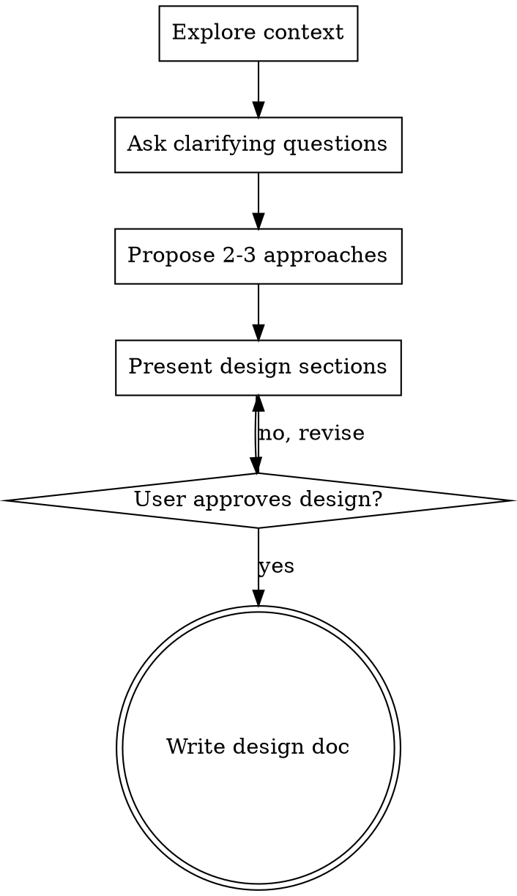

# /thought-partner — Collaborative Design Refinement

## Overview

Help refine ideas into clear, validated designs through collaborative dialogue.

Start by understanding the context, then ask questions one at a time to sharpen the thinking. Once the idea is solid, capture it in a design doc.

<HARD-GATE>
Do NOT invoke any implementation skill, write any code, scaffold any project, or take any implementation action until you have presented a design and the user has approved it. This applies to EVERY idea regardless of perceived simplicity.
</HARD-GATE>

## When to Use

- Refining feature work after a PRD but before building
- Setting up internal structures (processes, frameworks, systems)
- Going back and forth to clarify thinking on a fuzzy idea
- Designing something where the shape isn't obvious yet

## Anti-Pattern: "This Is Too Simple To Need A Design"

Every idea goes through this process. "Simple" ideas are where unexamined assumptions cause the most wasted work. The design can be short (a few sentences for truly simple ideas), but you MUST present it and get approval.

## Checklist

You MUST create a task for each of these items and complete them in order:

1. **Explore context** — check files, docs, prior decisions for relevant background
2. **Ask clarifying questions** — one at a time, understand purpose/constraints/success criteria
3. **Propose 2-3 approaches** — with trade-offs and your recommendation
4. **Present design** — in sections scaled to their complexity, get user approval after each section
5. **Write design doc** — save to `docs/plans/YYYY-MM-DD-<topic>-design.md` and commit

## Process Flow

**The terminal state is the design doc.** This skill ends with a written, committed design document. What happens next is up to the user — they may invoke writing-plans, start building, or just sit with it.

## The Process

**Understanding the context:**
- Check out relevant project state first (files, docs, prior decisions)
- Ask questions one at a time to refine the idea
- Prefer multiple choice questions when possible, but open-ended is fine too
- Only one question per message — if a topic needs more exploration, break it into multiple questions
- Focus on understanding: purpose, constraints, success criteria

**Exploring approaches:**
- Propose 2-3 different approaches with trade-offs
- Present options conversationally with your recommendation and reasoning
- Lead with your recommended option and explain why

**Presenting the design:**
- Once you believe you understand the idea, present the design
- Scale each section to its complexity: a few sentences if straightforward, up to 200-300 words if nuanced
- Ask after each section whether it looks right so far
- Cover what's relevant from: architecture, components, data flow, key decisions, constraints, open questions
- Be ready to go back and clarify if something doesn't make sense

## After the Design

**Documentation:**
- Write the validated design to `docs/plans/YYYY-MM-DD-<topic>-design.md`
- Commit the design document to git
- That's it. The user decides what happens next.

## Key Principles

- **One question at a time** — Don't overwhelm with multiple questions
- **Multiple choice preferred** — Easier to answer than open-ended when possible
- **Push back** — If the idea is vague or the reasoning is shaky, say so
- **YAGNI ruthlessly** — Remove unnecessary complexity from all designs
- **Explore alternatives** — Always propose 2-3 approaches before settling
- **Incremental validation** — Present design, get approval before moving on
- **Be flexible** — Go back and clarify when something doesn't make sense
- **Match the user's energy** — Sometimes this is a focused 5-question session, sometimes it's a long winding conversation. Both are fine.
